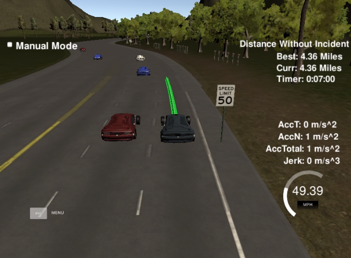

## Path planning project reflection
For path planning, the code of the lesson "Implement Behavior Planner in C++"was adapted, 
in addition to the code from the video "Project Q&A". The main calculation takes place in the Vehicle class.
Namely: updating the position, updating information about the previous path from the simulator, 
updating data about surrounding objects (main.cpp:580-582). Then, based on the information received, the optimal path 
and speed are calculated (main.cpp:588). The calculated trajectory points are sent to the simulator. 

One of the main concepts is a state machine with defined states and possible transitions. They are described in 
Vehicle::successor_states() (main.cpp:38). Basic states: keep lane, preparation to lane change left, 
preparation to lane change right, lane change left, lane change right. Then for each of the possible states are 
calculated next lane, velocity and state (main.cpp:425).

Another concept for achieving the goal is to find the optimal trajectory. To calculate the optimal trajectory, 
I decided to use only the speed cost function, since there is no need to arrive in a specific lane. To estimate the 
optimal trajectory, information about the surrounding objects is additionally used (main.cpp:427-470). After finding 
the optimal trajectory, the state of the ego car is additionally updated.

The car has successfully completed 4.32 miles without incident  

Full video: https://youtu.be/H1YufPvcuAQ